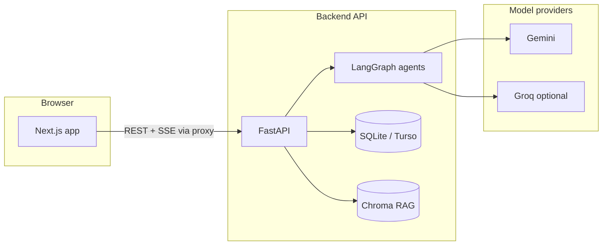

# ParikshaMitra — Tech Stack & MVP Workflow

This note is meant for **explaining the prototype**: what you built, how the pieces connect, and how a user moves through the MVP.

---

## What the MVP is

**ParikshaMitra** is a study companion for Indian competitive exams (JEE, NEET, GATE, or a custom exam label). The MVP does four big things:

1. **Onboards** the student with profile + exam date + daily hours.  
2. Runs a **15-question diagnostic** across subjects to **calibrate mastery** on a **concept graph** (topics and prerequisites).  
3. Uses **AI agents** to turn results into a **readiness score**, a **weekly plan**, a **bilingual nudge** (English + Hindi), and a **follow-up mini-quiz**.  
4. Supports **ongoing practice**: adaptive quiz, concept graph view, optional **library uploads** (RAG), **snap-a-doubt**, and **voice Q&A**.

The “special sauce” is not a single chatbot—it is a **small workflow of specialized agents** (analyze → plan → personalize → motivate) orchestrated like a pipeline, with optional **live trace** over SSE so the UI can show what the system is doing.

---

## Architecture at a glance

- **Frontend** talks to **one public origin** in production (or `/pm-api` rewrite in dev).  
- **Backend** owns persistence, business rules, and all LLM calls.  
- **LangGraph** runs the agent steps as a graph; results are saved on the user record and streamed to the client when needed.

---

## Tech stack (what each layer uses)

### Frontend

| Piece | Role |
|--------|------|
| **Next.js (App Router)** | Pages: landing, onboarding, diagnostic, dashboard, quiz, graph, doubt, library. |
| **React + TypeScript** | Components, hooks, typed API contracts. |
| **Tailwind CSS v4** | The dark-first UI (purple/cyan accents, glassy cards, gradient background); optional light theme via `data-theme`. |
| **Radix UI + small primitives** | Accessible dialogs, tabs, progress, etc. |
| **Framer Motion** | Light motion (e.g. question transitions). |
| **Recharts / Cytoscape** | Dashboard charts and the **knowledge graph** visualization. |
| **Sonner** | Toasts for errors and feedback. |

The client keeps **`user_id` in localStorage** and uses **sessionStorage** for the diagnostic question payload and last agent `run_id` (for the live trace).

### Backend

| Piece | Role |
|--------|------|
| **FastAPI** | REST API: users, onboarding, plan/dashboard, quiz, graph data, RAG, doubt, voice, calendar export, SSE stream. |
| **SQLAlchemy (async)** | ORM; default **SQLite** locally, **Turso (libSQL)** in production when configured. |
| **LangGraph** | Orchestrates **Analyst → Planner → Personalizer → Companion** (with a variant for “first diagnostic” vs “after quiz”). |
| **Google Gemini** | Structured JSON for planning, analysis, personalization, doubt answering, etc. |
| **Groq** | Optional faster/cheaper path for some tasks (e.g. quiz batch fallback, transcription for voice). |
| **NetworkX** | In-memory **DAG** over exam concepts (prerequisites, coverage, weak prereqs). |
| **Chroma + pypdf** | **RAG**: ingest PDFs, chunk, embed, retrieve for grounded quiz / answers. |
| **sse-starlette** | **Server-Sent Events** for the agent trace (`/stream/agent-trace/{run_id}`). |

### Static data shipped with the backend

- **Concept graphs** as JSON (`jee_dag.json`, `neet_dag.json`) — nodes, edges, weights, subjects.  
- **Seed question bank** — real MCQs so the diagnostic still works if the LLM is slow or unavailable.

---

## MVP user workflow (happy path)

1. **Landing** → user clicks through to **onboarding**.  
2. **Onboarding form** → name, exam type, exam date, daily study hours → **`POST /onboard/start`**.  
   - Backend creates/updates the user, samples concepts from the DAG, generates (or pulls from seeds) **15 questions**, returns `user_id` + questions.  
3. **Diagnostic UI** → user answers all 15 → **`POST /onboard/submit`**.  
   - Backend **grades locally** (correct option index), **updates mastery and SM-2 cards**, then runs the **diagnostic LangGraph**:  
     - **Analyst** — readiness + weak prerequisites (+ optional LLM insight).  
     - **Planner** — 7-day plan (LLM + safe fallbacks if JSON is imperfect).  
     - **Personalizer** — suggests a **follow-up test** and generates questions.  
     - **Companion** — **EN/HI nudge**.  
   - State is **persisted**; response includes plan, readiness, nudge, `run_id`.  
4. **Dashboard** → **`GET /plan/{user_id}/dashboard`**: plan strip, readiness gauge, subject radar, trend, optional **rank-style projection** if exam date exists, streak, pomodoro, export calendar, link to quiz/graph.  
5. **Quiz** → start / answer / finish; finish triggers the **post-quiz graph** (analyst may route to replan or straight to companion path).  
6. **Graph page** → cytoscape view of mastery on the DAG.  
7. **Library / Doubt / Voice** → optional flows using RAG, multimodal doubt, or voice (Groq STT + LLM).

That sequence is what you demo as “the MVP story.”

---

## How the “agent architecture” is explained in one minute

- You are **not** claiming one omniscient model. You have **roles**:  
  - **Analyst** — “Where is the student weak, and what’s the readiness number?”  
  - **Planner** — “What should this week look like?”  
  - **Personalizer** — “What short follow-up assessment closes the loop?”  
  - **Companion** — “How do we explain it and motivate in two languages?”  
- **LangGraph** wires those steps and branches (e.g. after a normal quiz, analyst may or may not trigger a full replan).  
- **SSE** lets the UI show **transparency**: orchestrator and agent steps as they complete.

That is the **4+1 cognitive architecture** story: four specialist agents plus the **orchestrator/graph** that routes them.

---

## Security & keys (prototype reality)

- Identity is **per-device `user_id`** (no full auth stack in the MVP).  
- **API keys** for Gemini/Groq can be **server defaults** or **BYOK headers** (`X-Gemini-Key`, `X-Groq-Key`) for demos or power users.  
- CORS and rewrite rules tie the **Next** origin to the **FastAPI** origin in deployment.

---

## One-sentence pitch you can reuse

> “ParikshaMitra is a Next.js + FastAPI prototype that calibrates students on a real prerequisite graph, runs a small LangGraph crew of specialist agents powered by Gemini, and turns diagnostic + practice data into readiness, weekly plans, and bilingual coaching—optionally with RAG, voice, and a live agent trace.”

---

*File: `explaination.md` — for demos, documentation, and interviews.*
